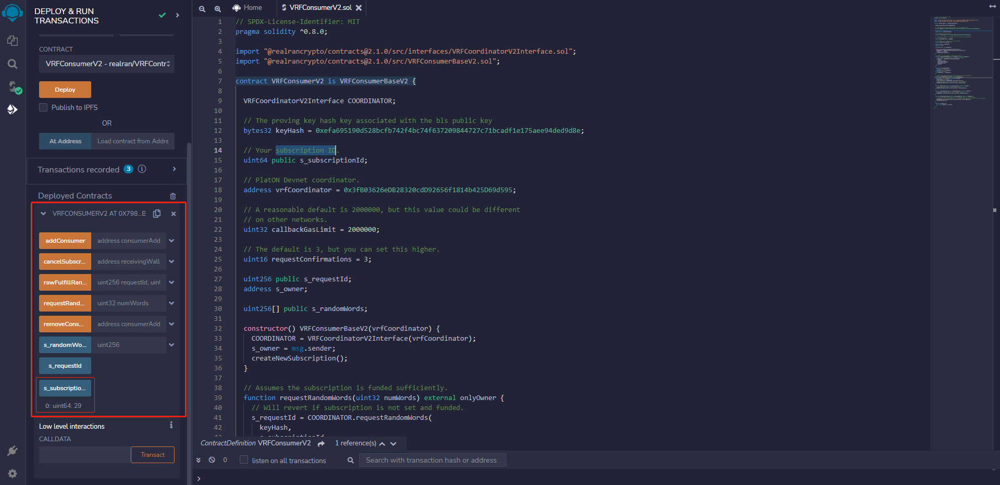
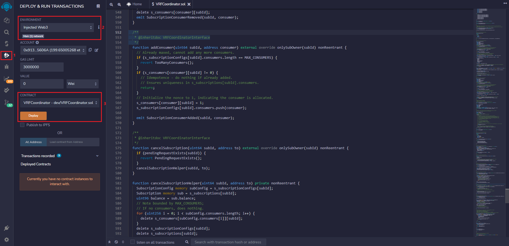

One simple example is shown below to demonstrate how to use Remix IDE to deploy the `VRFConsumerV2.sol` contract on PlatON and get random values. 

## Deploy a VRF consumer contract

### Import VRFContract Repo

Open the [VRFConsumerV2.sol](https://remix.ethereum.org/#url=https://github.com/realran/VRFContract/blob/main/sample/v2.1.0/VRFConsumerV2.sol) contract in Remix.

 

For this example, use the `VRFConsumerV2.sol` sample contract in the sample folder. This contract imports the following dependencies:
  - `VRFCoordinatorV2Interface.sol`
  - `VRFConsumerBaseV2.sol`

The sample contract imports the VRFContract codebase and uses relative paths to import dependencies. However, it is not a must. You could directly import dependencies from [NPM](https://www.npmjs.com/package/@realrancrypto/contracts) without loading the codebase. To do it, just add codes at the beginning of your consumer contract:

```
import "@realrancrypto/contracts@2.1.0/src/interfaces/VRFCoordinatorV2Interface.sol";
import "@realrancrypto/contracts@2.1.0/src/VRFConsumerBaseV2.sol";
```

The contract also includes pre-configured values for the necessary request parameters such as `callbackGasLimit`, `requestConfirmations`. When you deploy your own contract, you can use the same value as provided in the contract. For the parameter `keyHash`, `vrfCoordinator`, You can change its value based on different networks.

###  Compile the `VRFConsumerV2.sol` contract

Before compiling, please get the `keyHash` and `VRFCoordinator` address based on the network in the <a href="#Preparation">Preparation section</a>. In the `VRFConsumerV2.sol` contract, use **Devnet's** `VRFCoordinator` address.


1. Open the `VRFConsumerV2.sol` contract in Remix.
2. Click the **Solidity compiler** tab on the left sidebar.
3. Click the **Compile VRFConsumerV2.sol** button. Ignore the warnings here.

###  Deploy the `VRFConsumerV2.sol` contract


1. On the Remix left sidebar, click the **Deploy & run transactions** tab.

2. select the **Injected Provider - Metamask** Environment.

3. Select the `VRFConsumerV2` contract and click the **Deploy** button. MetaMask opens and asks you to confirm the transaction.

4. A subscription is automatically created when the contract is deployed, and the subscription ID is queried.



###  Load `VRCoordinatorV2.sol` contract and recharge subscription

1. Open the [VRCoordinatorV2.sol](https://remix.ethereum.org/#url=https://github.com/realran/VRFContract/blob/main/sample/v2.1.0/VRFCoordinatorV2.sol) contract in Remix and compile it.

2. Load `VRCoordinatorV2.sol` contract, fill in the `VRFCoordinator` address in the red box 3 and click the At Address button

 

3.  Recharge subscription, in the example, recharge 1 LAT to the subscription with ID 29


### Request random values

The deployed `VRFConsumerV2` contract requests random values from `VRFCoordinator`, receives those values, and stores them in the `s_randomWords` array. Run the `requestRandomWords()` function to request them.

1. Request 10 VRF values


2. Get the 10th VRF value at index 9


## Analyze the `VRFConsumerV2` contract

As a consumer of random numbers, the Consumer contract also has subscription management functions, including `createSubscription`, `addConsumer`, `removeConsumer`, and `cancelSubscription`. Therefore, this contract has the authority to manage subscriptions. You can split Consumer and Subscription Management according to your actual usage scenarios.

 ```
// SPDX-License-Identifier: MIT
pragma solidity ^0.8.0;

import "@realrancrypto/contracts@2.1.0/src/interfaces/VRFCoordinatorV2Interface.sol";
import "@realrancrypto/contracts@2.1.0/src/VRFConsumerBaseV2.sol";

contract VRFConsumerV2 is VRFConsumerBaseV2 {

  VRFCoordinatorV2Interface COORDINATOR;

  // The proving key hash key associated with the bls public key
  bytes32 keyHash = 0xefa695190d528bcfb742f4bc74f637209844727c71bcadf1e175aee94ded9d8e;

  // Your subscription ID.
  uint64 public s_subscriptionId;

  // PlatON Devnet coordinator.
  address vrfCoordinator = 0x3fB03626eDB28320cdD92656f1814b425D69d595;

  // A reasonable default is 2000000, but this value could be different
  // on other networks.
  uint32 callbackGasLimit = 2000000;

  // The default is 3, but you can set this higher.
  uint16 requestConfirmations = 3;

  uint256 public s_requestId;
  address s_owner;

  uint256[] public s_randomWords;

  constructor() VRFConsumerBaseV2(vrfCoordinator) {
    COORDINATOR = VRFCoordinatorV2Interface(vrfCoordinator);
    s_owner = msg.sender;
    createNewSubscription();
  }

  // Assumes the subscription is funded sufficiently.
  function requestRandomWords(uint32 numWords) external onlyOwner {
    // Will revert if subscription is not set and funded.
    s_requestId = COORDINATOR.requestRandomWords(
      keyHash,
      s_subscriptionId,
      requestConfirmations,
      callbackGasLimit,
      numWords
    );
  }

  function fulfillRandomWords(
    uint256, /* requestId */
    uint256[] memory randomWords
  ) internal override {
    s_randomWords = randomWords;
  }

  // Create a new subscription when the contract is initially deployed.
  function createNewSubscription() private onlyOwner {
    // Create a subscription with a new subscription ID.
    address[] memory consumers = new address[](1);
    consumers[0] = address(this);
    s_subscriptionId = COORDINATOR.createSubscription();
    // Add this contract as a consumer of its own subscription.
    COORDINATOR.addConsumer(s_subscriptionId, consumers[0]);
  }

  function addConsumer(address consumerAddress) external onlyOwner {
    // Add a consumer contract to the subscription.
    COORDINATOR.addConsumer(s_subscriptionId, consumerAddress);
  }

  function removeConsumer(address consumerAddress) external onlyOwner {
    // Remove a consumer contract from the subscription.
    COORDINATOR.removeConsumer(s_subscriptionId, consumerAddress);
  }

  function cancelSubscription(address receivingWallet) external onlyOwner {
    // Cancel the subscription and send the remaining Token to a wallet address.
    // In this version, receivingWallet is a reserved field that users can fill out as they please.
    COORDINATOR.cancelSubscription(s_subscriptionId, receivingWallet);
    s_subscriptionId = 0;
  }

  modifier onlyOwner() {
    require(msg.sender == s_owner);
    _;
  }
}
 ```

 In this example, The `VRFConsumerV2` contract address is the `VRFCoordinator` subscription owner and uses that subscription. The consumer contract uses static configuration parameters.

 The contract includes the following parameters:

  - `s_subscriptionId`: the subscription ID.
  - `keyHash`: the proving key hash key associated with the bls public key.
  - `vrfCoordinator`: the address of the VRFCoordinator contract.
  - `s_randomWords`: used to store random values.


 The contract includes the following functions:

  - `createNewSubscription()`: creates a new subscription and add the consumer itself to the subscription when the contract is initially deployed.
  - `requestRandomWords()`: requests random values asynchronously.
  - `fulfillRandomWords()`: receives random values and stores them with the contract.
  - `addConsumer()`: add a consumer contract to the subscription.
  - `removeConsumer()`: remove a consumer contract from the subscription.
  - `cancelSubscription()`: cancel the subscription.
