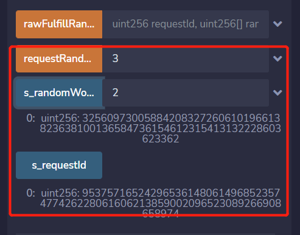

This guide explains how to get random values using a simple contract to request and receive random values from realran VRF v2. 

##  Preparation

- PlatON RPC URL:
  - Mainnet: `https://openapi2.platon.network/rpc`
  - Devnet: `https://devnet2openapi.platon.network/rpc`
- `VRFCoordinator` contract address：
  - Mainnet: `/`
  - Devnet2: `0x67dc19ca89EA3D322B8C7cC4AD2B3BA7bDF2d089`
- `Key Hash`
  - Mainnet: `/`
  - Devnet: `0x818b4b257c281d2e4db77e3bb13733185a31ab805d863047ef7093e2379e87cd`

This guide assumes that you know how to create and deploy smart contracts on PlatON Devnet2 using the following tools:

- [The Remix IDE](https://remix.ethereum.org/)
- [MetaMask](https://metamask.io/)
- [PlatON Devnet2 Faucet](https://devnet2faucet.platon.network/faucet)


## How to get random number

We will demonstrate how to use the `Subcription Management Dapp` to get random numbers on the `PlatON Devnet2` network. The process is as follows:

1. **Link to Subcription Management Dapp**: Open [Subcription Management Dapp](https://vrf.realran.com/), link it to Metamask and set  it to use the PlatON Devnet2 network. Then please check your wallet for Whether the LAT for testing is enough, otherwise, you can get more from [faucet](https://devnet2faucet.platon.network/faucet);
2. **Create subscription**: Click **My Subscriptions** on the homepage, you will enter the subscription management page corresponding to the current wallet address, where you can do a series of operations, such as creating a subscription and funding it,  and then adding VRF consumer to the specified subscription etc.; 
3. **fund the subscription**: After completing the creation according to the instructions on the **My Subscriptions** page, you can fund the subscription. Any address can fund your subscription, but only the owner of the subscription can manage the subscription's balance;
4. **Deploy the Consumer contract** : You can refer to the [RandomNumberConsumer](#Analyzing the contract) sample contract to finish your own consumer contract and deploy it in Remix. **Note that** before deployment, you need to fill in the subId obtained after creating the subscription above into your own Consumer contract;
5. **Add Consumer contract to subscription**: On the **My Subscriptions** page, click `Add Consumer` to add the address of the consumer contract deployed in the previous step to the specified subscription. You can proceed to the next test if you add it successfully;
6. **Get random numbers in Consumer**: It is a good choice to use remix to interact with the Consumer contract. You need to initiate a transaction requesting random numbers by calling the `requestRandomWords` method. In this transaction, you can use the `numWords` parameter to control the number of random numbers you want to get.
7. **Result verification**: In this example, the random number will be stored in `s_randomWords`. You can check the value of this parameter to confirm whether the random number is obtained. If you get the same result as the picture below, congratulations on getting the random number successfully



## Analyzing the contract

```
// SPDX-License-Identifier: MIT
// This is an example of consumer contract with some preconditions：
// 1. The subscription has been created and you have got the subId 
// 2. The subscription has been funded with enough balance
pragma solidity ^0.8.0;

import "@realrancrypto/contracts@2.0.0/src/interfaces/VRFCoordinatorV2Interface.sol";
import "@realrancrypto/contracts@2.0.0/src/VRFConsumerBaseV2.sol";

/**
 * THIS IS AN EXAMPLE CONTRACT THAT USES HARDCODED VALUES FOR CLARITY.
 * THIS IS AN EXAMPLE CONTRACT THAT USES UN-AUDITED CODE.
 * DO NOT USE THIS CODE IN PRODUCTION.
 */

contract RandomNumberConsumer is VRFConsumerBaseV2 {

  VRFCoordinatorV2Interface COORDINATOR;

  // Your subscription ID.
  uint64 s_subscriptionId = 18;

  // The proving key hash key associated with the bls public key
  bytes32 keyHash = 0x818b4b257c281d2e4db77e3bb13733185a31ab805d863047ef7093e2379e87cd;

  // PlatON Devnet coordinator.
  address vrfCoordinator = 0x67dc19ca89EA3D322B8C7cC4AD2B3BA7bDF2d089;

  // A reasonable default is 2000000, but it depends on the number of 
  // requested values that 
  // you want sent to the fulfillRandomWords() function.
  uint32 callbackGasLimit = 2000000;

  // The default is 3, but you can set this higher.
  uint16 requestConfirmations = 3;

  uint256 public s_requestId;
  address s_owner;
  uint256[] public s_randomWords;

  constructor() VRFConsumerBaseV2(vrfCoordinator) {
    COORDINATOR = VRFCoordinatorV2Interface(vrfCoordinator);
    s_owner = msg.sender;
  }

  // Assumes the subscription is funded sufficiently.
  function requestRandomWords(uint32 numWords) external onlyOwner {
    // Will revert if subscription is not set and funded.
    s_requestId = COORDINATOR.requestRandomWords(
      keyHash,
      s_subscriptionId,
      requestConfirmations,
      callbackGasLimit,
      numWords
    );
  }

  function fulfillRandomWords(
    uint256, /* requestId */
    uint256[] memory randomWords
  ) internal override {
    s_randomWords = randomWords;
  }

  
  modifier onlyOwner() {
    require(msg.sender == s_owner);
    _;
  }
}
```

