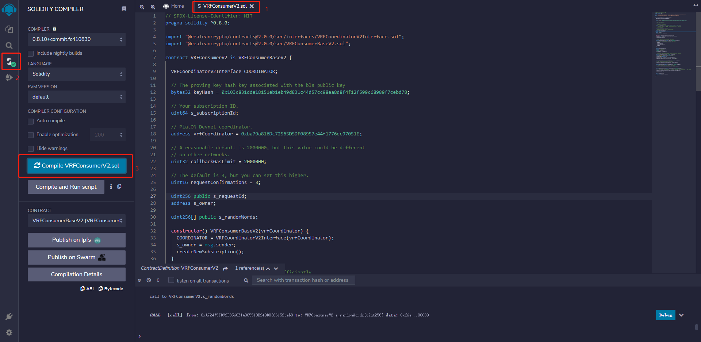
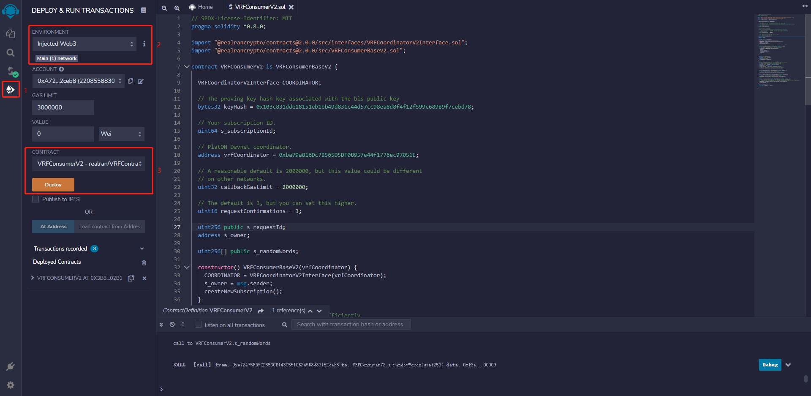
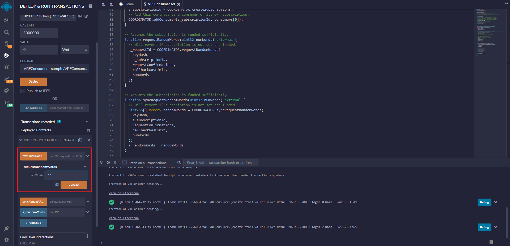
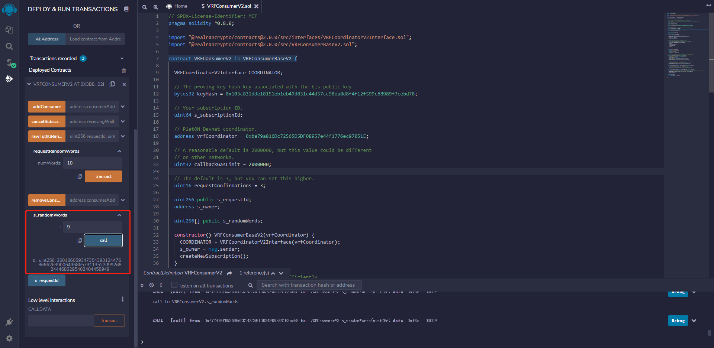

One simple example is shown below to demonstrate how to use Remix IDE to deploy the `VRFConsumer.sol` contract on PlatON and get random values. 

##  Preparation
- MetaMask
- The Remix IDE
- PlatON RPC URL:
	- Mainnet: `https://openapi2.platon.network/rpc`
	- Devnet: `https://devnetopenapi2.platon.network/rpc`
- `VRFCoordinator` contract address：
	- Mainnet: `0x57baee54708657302e96004279a15d7c98cd1a42`
	- Devnet: `0x356d552150f460f57Cd722DC4f3D03A3f2B8386C`

## MetaMask Setup

MetaMask is the most widely used browser plug-in wallet and users can easily interact with PlatON Devnet and Mainnet. See the [MetaMask Configure PlatON/Alaya Network](https://devdocs.platon.network/docs/en/MetaMask/) to learn to use it.

## Deploy a VRF consumer contract

### Import VRFContract Repo

Open the [VRFConsumer.sol](https://remix.ethereum.org/#url=https://github.com/realran/VRFContract/blob/main/sample/VRFConsumer.sol) contract in Remix.

 


For this example, use the `VRFConsumer.sol` sample contract in the sample folder. This contract imports the following dependencies:
  - `VRFCoordinator.sol`
  - `VRFConsumerBase.sol`

The contract also includes pre-configured values for the necessary request parameters such as `keyHash`, `callbackGasLimit`, and `requestConfirmations`. When you deploy your own contract, you can use the same value as provided in the contract. For the parameter `vrfCoordinator`, You can change its value based on different networks.

###  Compile the `VRFConsumer.sol` contract



1. Open the `VRFConsumer.sol` contract in Remix.
2. Click the **Solidity compiler** tab on the left sidebar.
3. Click the **Compile VRFConsumer.sol** button. Ignore the warnings here.

###  Deploy the `VRFConsumer.sol` contract

Before the deployment, please get the `VRFCoordinator` address based on the network in the <a href="#Preparation">Preparation section</a>. In the `VRFConsumer.sol` contract, use **Devnet's** `VRFCoordinator` address.




1. On the Remix left sidebar, click the **Deploy & run transactions** tab.
2. select the **Injected Web3** Environment.
3. Select the `VRFConsumer` contract and click the **Deploy** button. MetaMask opens and asks you to confirm the transaction.

### Request random values

The deployed `VRFConsumer` contract requests random values from `VRFCoordinator`, receives those values, and stores them in the `s_randomWords` array. Run the `syncRequestRandomWords()` function to synchronously request them.

1. Request 10 VRF values



2. Get the 10th VRF value at index 9




## Analyze the `VRFConsumer` contract

 ```
// SPDX-License-Identifier: MIT
pragma solidity ^0.8.0;

import "@realrancrypto/contracts@1.0.0/src/dev/VRFCoordinator.sol";
import "@realrancrypto/contracts@1.0.0/src/VRFConsumerBase.sol";

contract VRFConsumer is VRFConsumerBase {
  VRFCoordinator COORDINATOR;
  
  // PlatON DevNet coordinator. 
  address vrfCoordinator = 0x356d552150f460f57Cd722DC4f3D03A3f2B8386C;
  
  // Default parameters, do not need to be modified.
  bytes32 keyHash = 0xd89b2bf150e3b9e13446986e571fb9cab24b13cea0a43ea20a6049a85cc807cc;

  // Your subscription ID.
  uint64 s_subscriptionId;

  // Default parameters, do not need to be modified.
  uint32 callbackGasLimit = 100;

  // Default parameters, do not need to be modified.
  uint16 requestConfirmations = 100;

  uint256 public s_requestId;
  address s_owner;

  uint256[] public s_randomWords;

  constructor() VRFConsumerBase(vrfCoordinator) {
    COORDINATOR = VRFCoordinator(vrfCoordinator);
    s_owner = msg.sender;
    //Create a new subscription when you deploy the contract.
    createNewSubscription();
  }

  // Create a new subscription when the contract is initially deployed.
  function createNewSubscription() private onlyOwner {
    // Create a subscription with a new subscription ID.
    address[] memory consumers = new address[](1);
    consumers[0] = address(this);
    s_subscriptionId = COORDINATOR.createSubscription();
    // Add this contract as a consumer of its own subscription.
    COORDINATOR.addConsumer(s_subscriptionId, consumers[0]);
  }

  // Assumes the subscription is funded sufficiently.
  function requestRandomWords(uint32 numWords) external {
    // Will revert if subscription is not set and funded.
    s_requestId = COORDINATOR.requestRandomWords(
      keyHash,
      s_subscriptionId,
      requestConfirmations,
      callbackGasLimit,
      numWords
    );
  }

  // Assumes the subscription is funded sufficiently.
  function syncRequestRandomWords(uint32 numWords) external {
    // Will revert if subscription is not set and funded.
    uint256[] memory randomWords = COORDINATOR.syncRequestRandomWords(
      keyHash,
      s_subscriptionId,
      requestConfirmations,
      callbackGasLimit,
      numWords
    );
    s_randomWords = randomWords;
  }

  function fulfillRandomWords(
    uint256, /* requestId */
    uint256[] memory randomWords
  ) internal override {
    s_randomWords = randomWords;
  }

  modifier onlyOwner() {
    require(msg.sender == s_owner);
    _;
  }
}
 ```

 In this example, The `VRFConsumer` contract address is the `VRFCoordinator` subscription owner and uses that subscription. The consumer contract uses static configuration parameters.

 The contract includes the following parameters:

  - `s_subscriptionId`: the subscription ID.
  - `vrfCoordinator`: the address of the PlatON VRFCoordinator contract.
  - `s_randomWords`: used to store random values.


 The contract includes the following functions:

  - `createNewSubscription()`: creates a new subscription and add the consumer itself to the subscription when the contract is initially deployed.
  - `requestRandomWords()`: requests random values asynchronously.
  - `fulfillRandomWords()`: receives random values and stores them with the contract.
  - `syncRequestRandomWords()`: requests random values synchronously.
