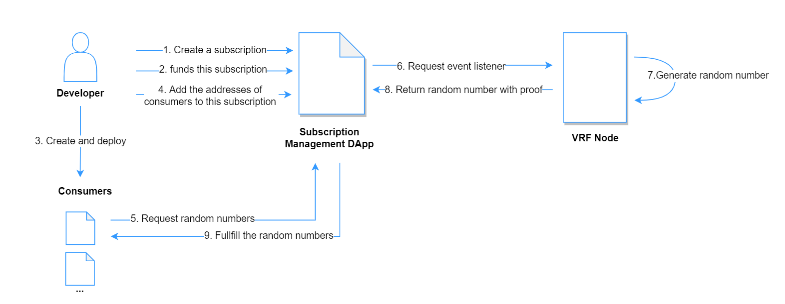

# RealRan 

RealRan is dedicated to building the Multi-party Trust Protocol in cryptography to power the next generation computing scenario, including Hybrid Smart Contract, Web3 and Metaverse.

## About VRF

VRF provides secure and verifiable random numbers for on-chain contracts, which enables random number consumers to focus more on their own business. And the ability to get multiple random numbers in one request may satisfy more usage scenarios.  

VRF2.0 will be launched on PlatON mainnet soon. After continuous optimization and iteration, VRF improved the subscription payment model, and reduced the gas consumption of each request by introducing a more secure ECDSA algorithm.

## Architecture

The following is a simple system structure description, which can give you a clear understanding of the composition of VRF system and how to use it.

Composition introduction：

- **Developer** : It can represent an individual developer or a team that need to use the VRF system. It should be noted that the wallet address that created the subscription will become its owner, and has the right to manage the consumers and funds belonging to the subscription. At the same time, anyone can recharge the subscription, not just the owner.

- **[Subcription Management Dapp](https://vrf.realran.com/)**:  This is a subscription management platform. This allows you to interact with on-chain contracts([VRFCoordinatorV2.sol](#)) through page operations, which makes it easy to create and manage your subscriptions.

  > **Tip:** Using Subscription Management Dapp is an option for you to create and manage subscriptions. If you are familiar enough with the VRFCoordinatorV2.sol, you can create and manage your subscriptions directly through you own contracts. [Here](./Get%20a%20Random%20Number) are some references for you.

- **Consumer**: Every contract that needs to use random numbers is considered a consumer.

- **VRF Node**:  VRF Service is an off-chain system responsible for monitoring random number requests on the chain, generating verifiable random numbers, and writing them into on-chain contracts. The nodes in the current system are limited, but it is in the process of being polished into a decentralized system.

